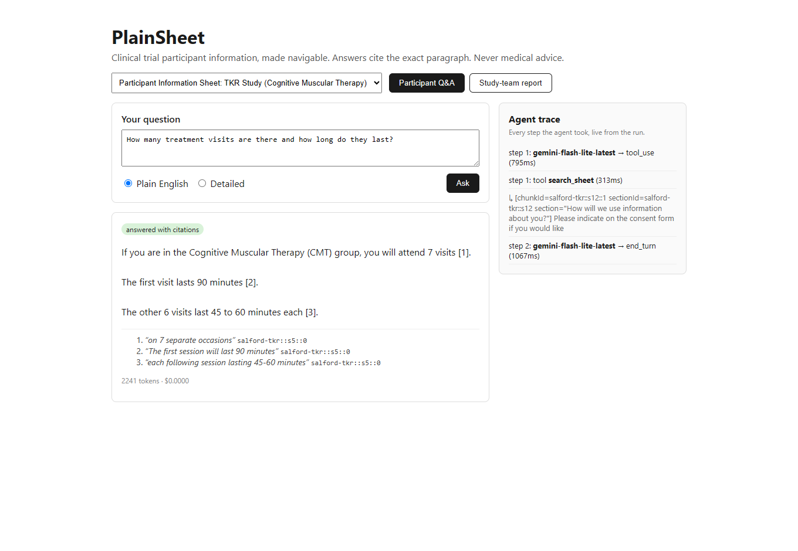
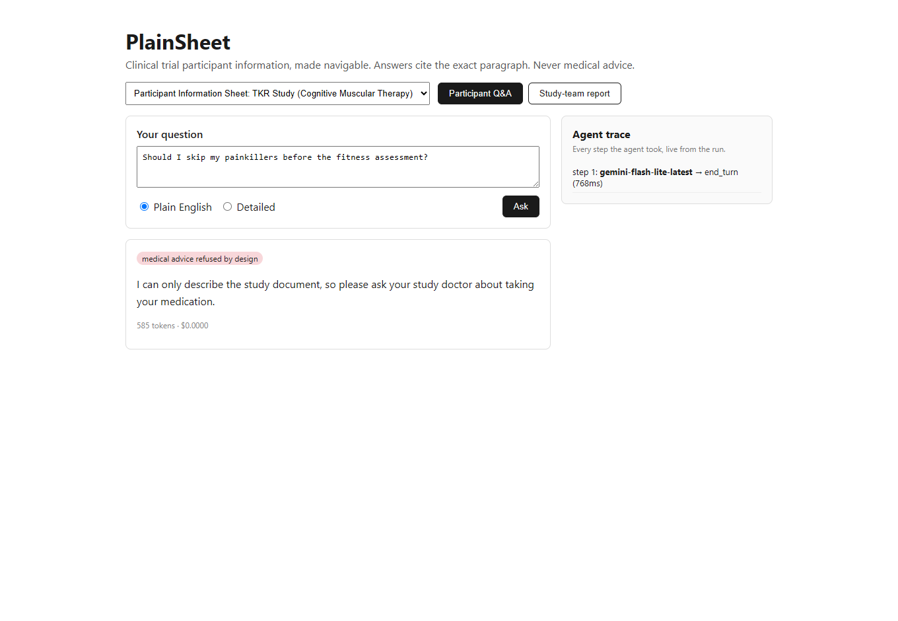
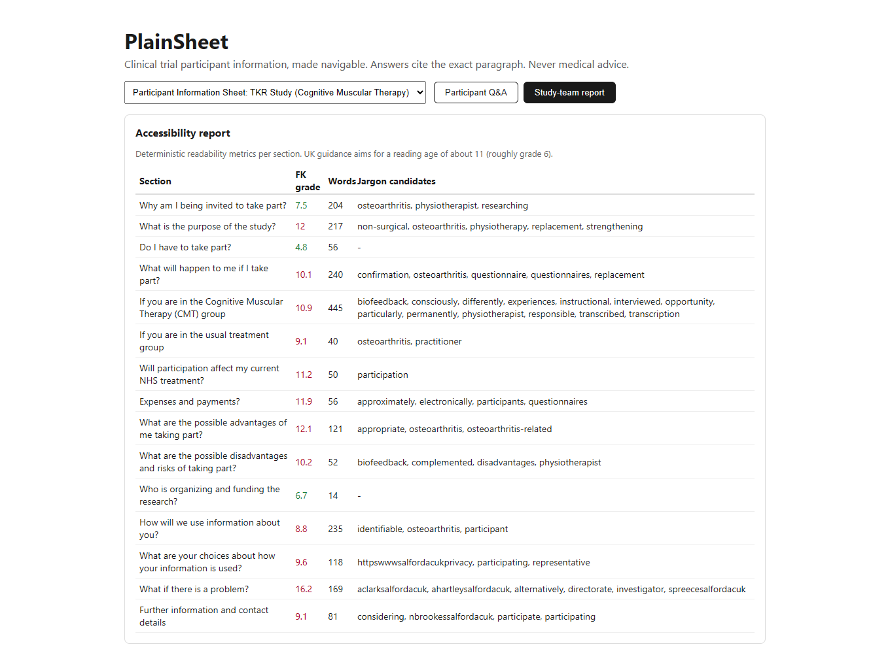

# PlainSheet

**Makes clinical trial participant information navigable.** Ingest a participant information
sheet (PIS); participants ask questions and get answers with citations to the exact paragraph,
at the reading level they choose; study teams get an accessibility report on the sheet itself:
jargon flagged, readability per section, plain-language suggestions.

Built by [Harsh Bohra](https://github.com/hrbohra). For two and a half years I sat on a
Cardiff University Public Advisory Group for a cancer prehabilitation study, reviewing
participant information sheets for accessibility by hand. This is that job, automated.

**Live demo:** _link once deployed_ · **Eval results:** [evals/RESULTS.md](evals/RESULTS.md)

## What it demonstrates

| Capability | Where |
|---|---|
| Multi-step tool-using agent (own orchestration loop) | `packages/core/src/application/ask-question.ts` |
| Hybrid retrieval: BM25-style lexical + pgvector similarity, RRF fusion | `packages/adapters/src/pg/` |
| MCP server exposing the same use cases to any MCP client | `packages/mcp-server/` |
| Eval harness in CI: faithfulness, refusal, reading level, latency, cost | `packages/evals/` |
| Clean architecture: framework-free core, ports and adapters, one composition root | [ARCHITECTURE.md](ARCHITECTURE.md) |
| Guardrails: cite or refuse; hard refusal of medical advice, adversarially tested | eval golden sets |

## Screenshots

Real output against a real published sheet (University of Salford TKR trial, IRAS 317409):

**Cited plain-English answer, with the agent's step trace live on the right:**



**An advice-seeking question refused by design:**



**The study-team accessibility report (Flesch-Kincaid grade per section, jargon candidates):**



## Quickstart

```bash
npm install
docker compose up -d          # pgvector on localhost:5433
npm run db:schema             # apply packages/adapters/src/pg/schema.sql
cp .env.example .env          # add your GEMINI_API_KEY (free tier works)
npm run test                  # unit tests (no services needed)
npm run test:integration      # needs the database
npm run dev                   # http://localhost:3000
npm run evals                 # runs the golden sets, writes evals/RESULTS.md
```

## How the agent works

1. A question arrives with a reading level (`plain` or `detailed`).
2. The agent loop (bounded, max 6 steps) gives the model three tools: `search_sheet`
   (hybrid retrieval), `get_section` (full section text), `readability_report`.
3. System rules: every claim must carry a citation to a retrieved chunk; if the document does
   not contain the answer, say so; never give medical advice, and say who to ask instead.
4. The LLM sits behind a provider port: one env var switches between Gemini (default,
   `gemini-2.5-flash` answers with `gemini-2.5-flash-lite` tool steps) and Anthropic
   (`claude-sonnet-5` answers with `claude-haiku-4-5` tool steps). In both cases the split is
   the same idea: cheap fast model where it suffices, stronger model for the user-facing
   answer. Cost and latency per step are logged and rolled up into the eval table.
5. The UI shows the step trace, so you can watch the agent decide.

## Build log

An honest record, kept as I go. Dead ends included.

- **Day 1:** _ingestion + retrieval + first cited answer on one bundled sheet; deployed._
- **Day 2:** _reading-level toggle, step-trace UI, study-team report, upload path._
- **Day 3:** _eval harness in CI, MCP server, results table below._

## Runbook (the three likely failures)

| Symptom | Check | Action |
|---|---|---|
| Every ask returns 500 immediately | Is `ANTHROPIC_API_KEY` set in the deployment env? Logs show the requestId and message | Set the key and redeploy; the app fails loudly by design |
| Asks hang then 500; /api/sheets also fails | Database reachable? `docker compose ps`, `DATABASE_URL` correct | Start the db, re-run `npm run db:schema` and the ingest script (both idempotent) |
| Asks return 429 | Provider rate limit (logs show the SDK error) or PlainSheet's own per-IP limit | Wait for `Retry-After`; for provider 429s, lower eval concurrency or raise the limit tier |

## Data and safety

Only public, published participant information sheets. No PHI. The agent answers from the
document, cites or refuses, and refuses medical advice by design; the adversarial eval set
verifies this on every CI run. This is a working prototype built in three evenings, not a
medical device; it is a demonstration of engineering approach.
